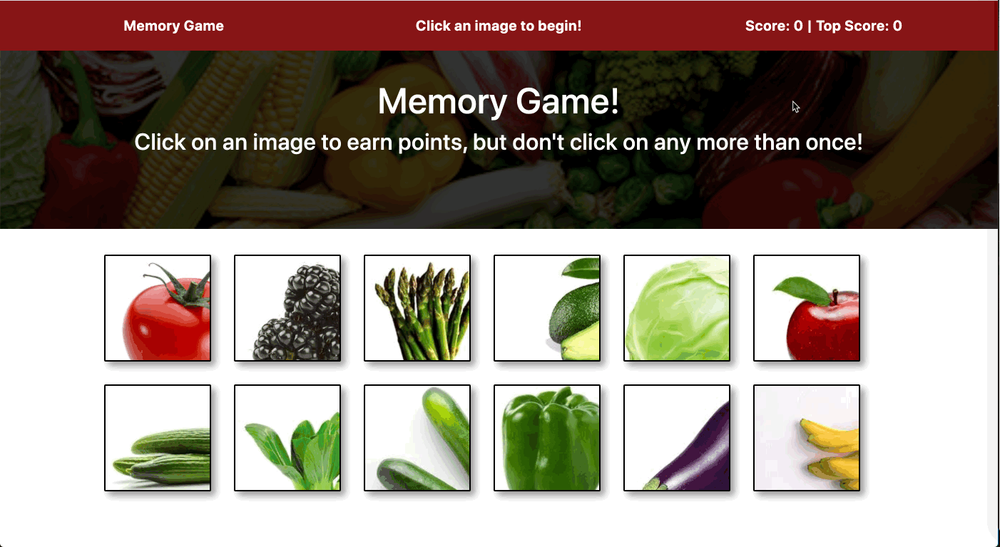

# Produce Clicky-game

https://produce-clicky-game.herokuapp.com/

React memory game, the player is given 12 images and instructs the player to click the images one at time without ever clicking the same image twice. Once an image is clicked, the images shuffle into a new order, and so on. 

## Live Demo 

## Technologies Used

- React
- React Router Dom 
- Javascript